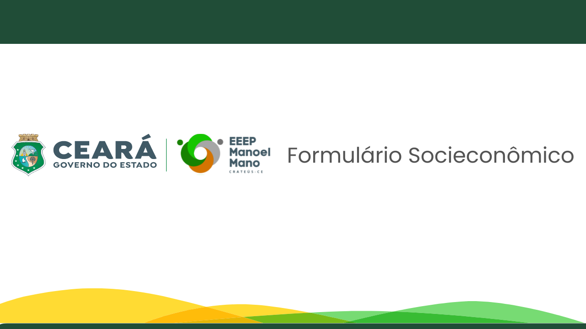

</img>
<h1 align="center">Formulário Socieconômico</h1>
<h1>Introdução</h1>
Contexto - Sistema Web para coleta de dados de saúde, sociais e econômicos das famílias dos alunos da EEEP Manoel Mano, o sistema terá com base um formulário utilizado no ato da matrícula e pós recursos do processo seletivo. Lista de Tarefas a serem feitas - Disponibilizar relatórios gerais sobre o perfil de quem entrou, relatórios gerais por curso (informática, comércio, enfermagem e administração) e relatórios específicos por turma, assim como nome dos alunos e quais suas comorbidades.

## 【📹】 **Projeto no Figma**
Para inspiração do projeto, primeiro desenvolvemos um protótipo no figma, com 3 páginas, são elas : Tela de Login, Formulário Socieconômico e Relatórios com Gráfico. E nelas foram baseadas para o projeto real.

## 【🛠️】 **Tecnologias**

- [Javascript](https://docs.oracle.com/en/)
- [HTML](https://developer.mozilla.org/en-US/docs/Web/HTML)
- [CSS](https://developer.mozilla.org/en-US/docs/Web/CSS)
- [ChartJS](https://www.chartjs.org/)
- [PHP](https://www.php.net/docs.php)

# Projeto Real

**Explicação do Projeto :**
> No `dados.php` só apresenta um pequeno resumo da pagina, e a afinidade do projeto. Assim é usado a pergunta a pergunta "O que é projeto ?".

## 【📚】 **Página :**
### **1.1**
Tela de Login : O usuário obrigatoriamente precisa ter um ID, nome e senha. Caso o cliente que esteja querendo entrar no sistema, precisa ter nomes e senhas iguais ao do banco de dados, caso contrário, dará erro. Assim, tem outra suposição, se o usuária querer entrar nas páginas sem efeituar o login, posteriormente ocorrerá um erro para o usuário efeituar o login, ou seja, essas páginas tem segurança(um mini protect)
### **1.2**
Formulário Socieconômico : O formulário por completo está divido em 7 etapas, são elas : Ficha de matrícula, um pequeno form com informações sobre sua matrícula, como, nome, CPF, data de nascimento. Segunda, Dados Adicionais : que são informações pessoais do aluno, por exemplo, nacionalidae, naturalidade, raça, sexo e entre outros. Terceiro, Dados Complementares : são infomações para completar os dados requeridos do aluno, como o meio de transporte escolar que ele usa, caso o aluno receba bolsa familía, tipos de deficiência. Quarto, Detalhamento da matrícula : são informações do inicio e final da ensimo médio do aluno, são os campos : Ano Letivo, Série/Turma, Data de Matrícula. Quinto, Progressão parcial : São os progressos do aluno no inicio e final do ensimo médio, são os campos : Ano Letivo, Escola, Série, Disciplina, Resultado. Sexto, Questionário socioeconômico do aluno : que são, dados referentes aos pais ou responsáveis, caso o aluno tenha outro responsável é disponibilizado um formulário para o preencimento dos campos, depois dados referente a família e por dados referente conclusão do formulário. Quanto terminado tudo isso é preenchido uma ficha de saúde do aluno
### **1.3**
Relátório com Gráficos : (AINDA FALTA)

<h1 align="center">【🔒】Desmotração Tela de Login </h1>

https://user-images.githubusercontent.com/90520597/233246026-22ab9a07-3b21-4009-9dad-7f741d71cddf.mp4

<h1 align="center">【📚】Desmotração Formulário Socieconômico </h1>

https://user-images.githubusercontent.com/90520597/233246265-2c45fb2a-1138-4270-94ef-6f49329b7e8a.mp4

<h1 align="center">【📊】Desmotração Relatórios </h1>

